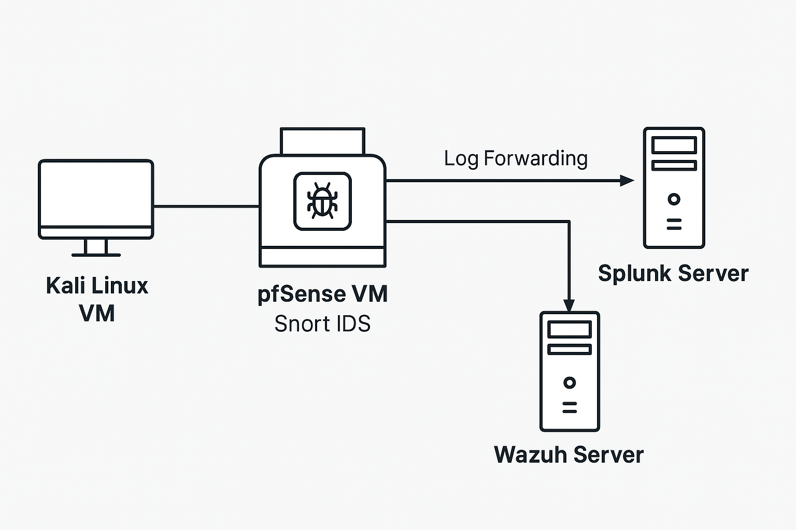

# pfSense + Snort Network Security Lab

This project demonstrates how to build a virtual network security lab using pfSense as the firewall and Snort as the IDS/IPS. It simulates real-world attacks (Nmap scans, brute-force, malware downloads) and shows how Snort detects them. Logs are forwarded to both Wazuh and Splunk for analysis. This lab is designed to highlight network security, threat detection, and SIEM integration skills.

## Lab Architecture



- pfSense VM  
  - Firewall + Snort IDS  
  - Forwards logs to Wazuh + Splunk

- Kali Linux VM  
  - Used to launch attacks: Nmap, Hydra, wget

- Splunk Server  
  - Receives logs from pfSense  
  - Parses and visualizes Snort alerts

- Wazuh Server  
  - Monitors logs from pfSense  
  - Triggers security alerts

- (Optional) Suricata  
  - For comparison with Snort

## Objectives

- Build a secure network with pfSense
- Detect network attacks using Snort
- Create and test custom Snort rules
- Forward pfSense logs to Splunk and Wazuh
- Analyze and tune alerts
- Compare Snort with Suricata
- Map activities to MITRE ATT&CK techniques

## Setup Guides

- [→ Install pfSense in VirtualBox](setup/pfsense-installation.md)
- [→ Configure Snort on pfSense](setup/snort-configuration.md)
- [→ Route Windows VM Traffic Through pfSense](setup/windows-routing-through-pfsense.md)

## Attack Simulations

| Simulation              | Technique | Tool         | Detection      |
|------------------------|-----------|--------------|----------------|
| Port Scanning          | T1046     | Nmap         | Snort alert    |
| Malware Download       | T1204     | wget EICAR   | Snort alert    |
| Brute Force Attack     | T1110     | Hydra        | Snort alert    |
| Custom Rule Triggering | -         | ping, ssh    | Custom rule    |

Details are in the `simulations/` folder.

## Documentation Index

| Category     | Files |
|--------------|-------|
| Setup        | `setup/pfsense-installation.md`, `snort-configuration.md`, `log-forwarding.md` |
| Rules        | `rules/custom-snort-rules.md`, `firewall-rules.md`, `rule-tuning-notes.md`     |
| Simulations  | `simulations/port-scan-detection.md`, `simulations/malware-traffic-eicar.md`, `simulations/brute-force-detection.md` |
| SIEMs        | `setup/splunk-integration.md`, `setup/wazuh-integration.md`                   |
| Comparison   | `comparisons/suricata-vs-snort.md`                                            |
| Troubleshoot | `troubleshooting/common-issues.md`                                            |

## Skills Demonstrated

- Intrusion Detection (Snort, Suricata)
- Firewall rule tuning (pfSense)
- Custom rule creation
- Log forwarding (syslog)
- Log analysis (Wazuh, Splunk)
- MITRE ATT&CK mapping
- Virtual lab setup (VirtualBox, VMware)

## MITRE ATT&CK Mapping

| Technique | Description                        |
|-----------|------------------------------------|
| T1046     | Network Service Scanning           |
| T1040     | Network Traffic Capture            |
| T1110     | Brute Force                        |
| T1204     | Malicious File Delivery            |

## Tools Used

- pfSense (2.7.x) – open-source firewall
- Snort 3 – signature-based IDS/IPS
- Splunk Free – log analysis platform
- Wazuh – open-source SIEM
- Kali Linux – attacker VM (Nmap, Hydra, curl)
- Suricata (optional) – IDS/IPS comparison

## Repo Structure

```
pfsense-snort-lab/
├── setup/                # Installation & configuration steps
├── rules/                # Snort and pfSense firewall rules
├── simulations/          # Attack scenarios and detection logs
├── comparisons/          # Suricata vs Snort
├── diagrams/             # Network architecture diagrams
├── troubleshooting/      # Issues and fixes
└── README.md             # This file
```

## License

MIT License

## About Me

Loksharan Saravanan  
MS Cybersecurity @ The City College of New York  
GitHub: https://github.com/loksharan-soc  
LinkedIn: https://linkedin.com/in/loksharan  
Email: loksharan.soc@gmail.com
